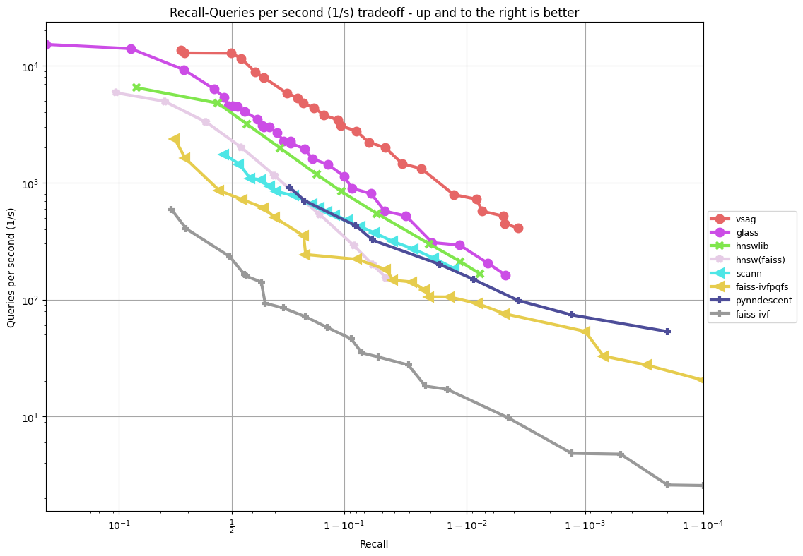

# VSAG

VSAG is a vector indexing library used for similarity search. The indexing algorithm allows users to search through various sizes of vector sets, especially those that cannot fit in memory. The library also provides methods for generating parameters based on vector dimensions and data scale, allowing developers to use it without understanding the algorithm’s principles. VSAG is written in C++ and provides a Python wrapper package called pyvsag.

## Performance
The VSAG algorithm achieves a significant boost of efficiency and outperforms the previous **state-of-the-art (SOTA)** by a clear margin. Specifically, VSAG's QPS exceeds that of the previous SOTA algorithm, Glass, by over 100%, and the baseline algorithm, HNSWLIB, by over 300% according to the ann-benchmark result on the GIST dataset at 90% recall.
The test in [ann-benchmarks](https://ann-benchmarks.com/) is running on an r6i.16xlarge machine on AWS with `--parallelism 31`, single-CPU, and hyperthreading disabled.
The result is as follows:

### gist-960-euclidean


## Getting Started
### Integrate with CMake
```cmake
# CMakeLists.txt
cmake_minimum_required(VERSION 3.11)

project (myproject)

set (CMAKE_CXX_STANDARD 11)

# download and compile vsag
include (FetchContent)
FetchContent_Declare (
  vsag
  GIT_REPOSITORY https://github.com/antgroup/vsag
  GIT_TAG main
)
FetchContent_MakeAvailable (vsag)
include_directories (vsag-cmake-example PRIVATE ${vsag_SOURCE_DIR}/include)

# compile executable and link to vsag
add_executable (vsag-cmake-example src/main.cpp)
target_link_libraries (vsag-cmake-example PRIVATE vsag)

# add dependency
add_dependencies (vsag-cmake-example vsag)
```
### Examples

Currently Python and C++ examples are provided, please explore [examples](./examples/) directory for details.

We suggest you start with [simple_hnsw.cpp](./examples/cpp/simple_hnsw.cpp) and [example_hnsw.py](./examples/python/example_hnsw.py).

## Building from Source
Please read the [DEVELOPMENT](./DEVELOPMENT.md) guide for instructions on how to build.

## Who's Using VSAG
- [OceanBase](https://github.com/oceanbase/oceanbase)
- [TuGraph](https://github.com/TuGraph-family/tugraph-db)
- [GreptimeDB](https://github.com/GreptimeTeam/greptimedb)


If your system uses VSAG, then feel free to make a pull request to add it to the list.

## How to Contribute

Although VSAG is initially developed by the Vector Database Team at Ant Group, it's the work of
the [community](https://github.com/antgroup/vsag/graphs/contributors), and contributions are always welcome!
See [CONTRIBUTING](./CONTRIBUTING.md) for ways to get started.

## Community
Thrive together in VSAG community with users and developers from all around the world.
- Discuss at [discord](https://discord.com/invite/JyDmUzuhrp).
- Follow us on [Weixin Official Accounts](./docs/weixin-qr.jpg)（微信公众平台）to get the latest news.

## Roadmap
- v0.12 (ETA: Oct. 2024)
  - introduce datacell as the new index framework
  - support pluggable scalar quantization(known as SQ) in datacell
  - implement a new Hierarchical Graph(named HGraph) index based on datacell
  - support INT8 datatype on HNSW Index

- v0.13 (ETA: Nov. 2024)
  - support inverted index(be like IVFFlat) based on datacell
  - introduce pluggable product quantization(known as PQ) in datacell
  - support extrainfo storage within vector

- v0.14 (ETA: Dec. 2024)
  - implement a new MultiIndex that supports efficient pre-filtering on enumerable tags
  - support automated parameter
  - support sparse vector searching

## Reference
Reference to cite when you use VSAG in a research paper:
```
@article{yang2024bridging,
  title={Bridging Speed and Accuracy to Approximate $ K $-Nearest Neighbor Search},
  author={Yang, Mingyu and Jin, Jiabao and Wang, Xiangyu and Shen, Zhitao and Jia, Wei and Li, Wentao and Wang, Wei},
  journal={arXiv preprint arXiv:2404.16322},
  year={2024}
}
```

## Star History

[](https://star-history.com/#antgroup/vsag&Date)

## License
[Apache License 2.0](./LICENSE)

